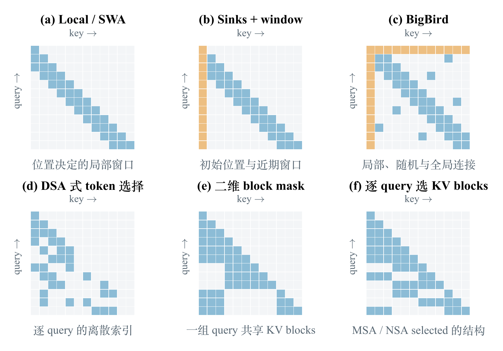
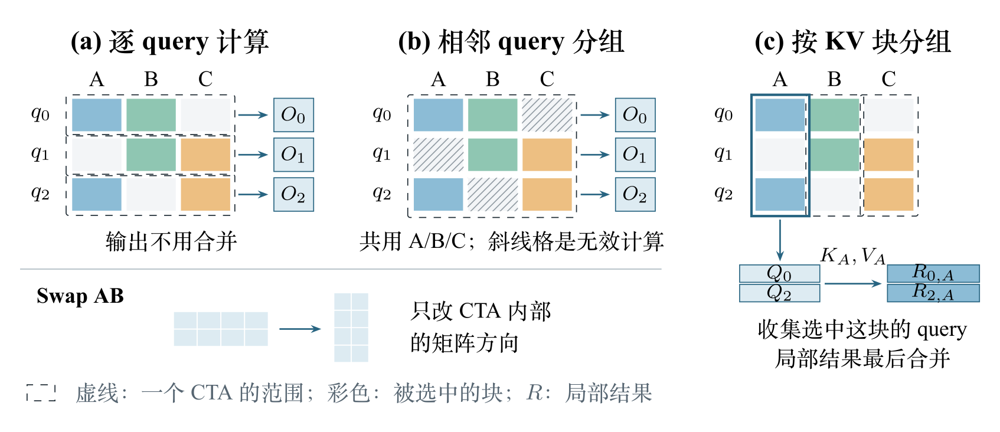
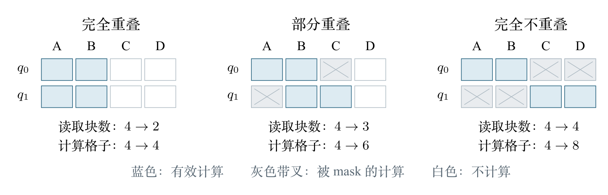
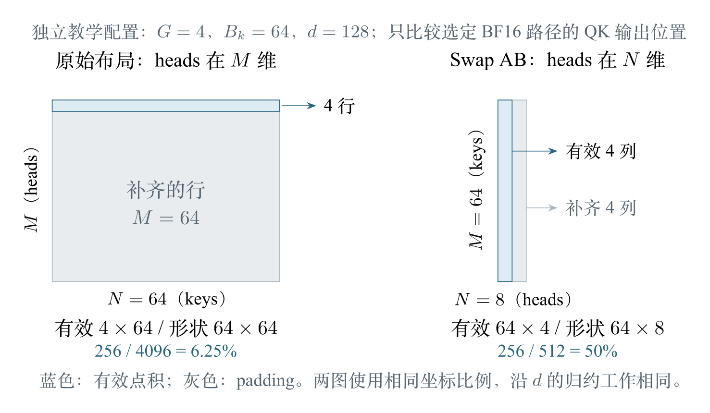
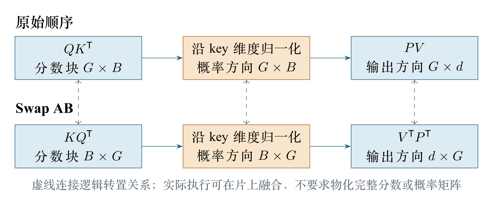
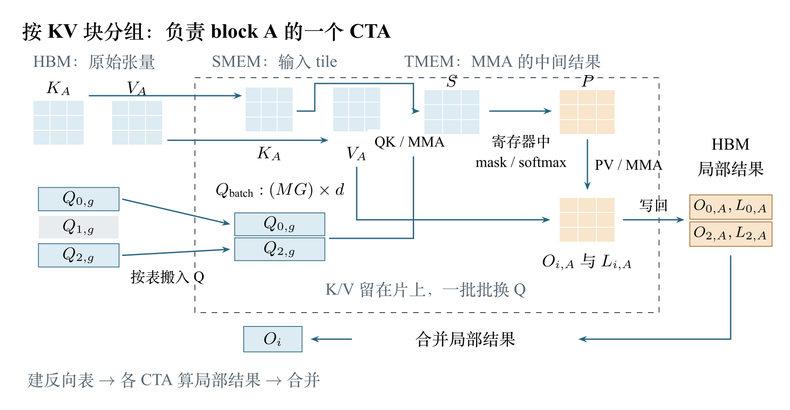
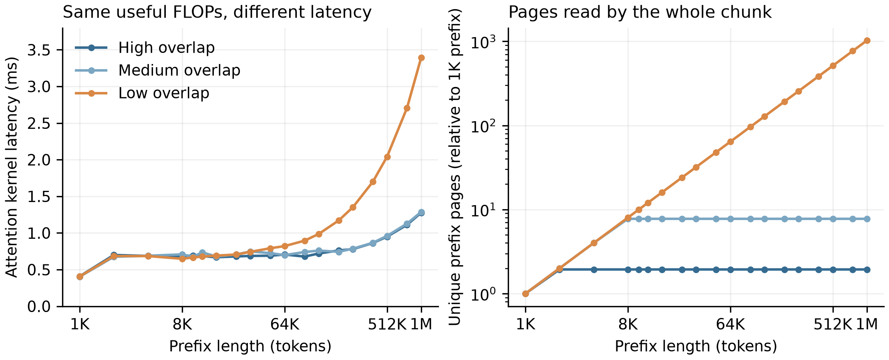

# 逐 Query Sparse Attention Kernel 的设计取舍

最近正在设计一个逐 Query 的 Block Sparse Attention，在设计的过程中前后尝试了几种不同的 Kernel 设计方案，这篇文章主要作为我的一部分工作总结，整理这些设计实测中观察到的问题。在进入正题之前，我们首先复习一下 Sparse Attention 相关的一些背景知识。

## 1 Sparse Attention 的几种模式

标准 attention 要算所有可见的 query-key 交互，长序列下计算量随长度平方增长； FlashAttention 省掉了中间矩阵的读写，但交互本身一个没少[1]。 Sparse attention 只让每个 query 看一部分 keys。图 1 列了几种常见做法： 有按位置固定的局部窗口、sinks 和 global tokens[2][3][4][5]， 也有按内容动态选择的 token 或 block[6][7][8]。

对 kernel 来说，关键是**不同 query 的选择是否相同**。 图 (e) 里一组 query 共用同一块 mask，选中区域天然是规整的矩阵； 图 (f) 里每个 query 单独选块，相邻两行未必选到同一块。本文讨论后一种。

MiniMax Sparse Attention（MSA）就是一个例子：先由一个轻量分支为每个 query 选出若干 KV 块， 再在选中的块上计算 attention[9]。本文只讨论第二步的训练前向，选块结果视为已知。

还需要一点 GQA 的背景[10]：$G$ 个 query heads 共用一份 K/V， 同一 token 的这 $G$ 个 heads 也共用同一份选块列表。 每个 KV 块包含 $B_k$ 个 token，所以一个 query 和一个块之间的 QK 是一个 $G\times B_k$ 的小矩阵。

## 2 遇到的问题

一个 query 和一个块之间只有 $G\times B_k$ 的小矩阵，而 $G$ 通常很小。设计 kernel 时，为了使设计的 kernel 有较好的性能，以下三件事是比较重要的：

- **填满 Tensor Core。**MMA 指令对矩阵形状有下限，$G$ 行远远不够，不足的部分只能 padding。
- **复用 K/V。**不同 query 常常选到同一个块，每个 query 各读一次，读取量会成为瓶颈。
- **不做多余的工作。**被 mask 掉的计算、局部结果的写出和合并、额外的索引，都会抵消前两项的收益。

然而以上三个条件在逐 Query Sparse Attention 中很难全部满足，首先看一个最小的例子：$q_0$ 选了 KV 块 A、B，$q_1$ 选了 B、C。 两个 query 分开算，B 要读两次，矩阵也只有 $G$ 行；放在一起算，B 只读一次，矩阵也变高了， 但这一组要把 A、B、C 都算一遍，其中 $q_0$ 对 C、$q_1$ 对 A 的结果最后都会被 mask 掉， 计算量从 4 个 query-block 对变成了 6 个。

换成 kernel 的语言，取舍体现在：这些小矩阵交给哪个线程块（CTA）计算？ 图 2 画了三种划分： (a) 一个 CTA 负责一个 query；(b) 一个 CTA 负责几个相邻 query，遍历它们选块的并集； (c) 一个 CTA 负责一个 KV 块，处理所有选中这个块的 query。

(a) 不做多余的工作，但既填不满 Tensor Core，也不复用 K/V； (b) 用被 mask 的计算换来了更高的矩阵和 K/V 复用； (c) 也能复用 K/V、填满矩阵，代价是反向索引、不连续地读 Q，以及合并局部结果。 此外还有一个和任务划分无关的办法 Swap AB：交换矩阵乘的两个操作数，换一个方向来填满 Tensor Core。

## 3 逐 query 计算

最直接的做法是一个 CTA 只负责一个 query 和它的 $G$ 个 heads。 Q 读一次，然后按选块列表依次读入 K/V，外层循环遍历 query、内层循环遍历 KV 块，这种方法一般称为 Q-outer 循环顺序；NSA 的 kernel 就是这样组织的[8][11]。

跨块的 softmax 用 online softmax 处理[12][1]： 每个 head 维护目前见过的最大分数和分母，遇到更大的分数时，先把已有结果整体缩放，再继续累加。 一个 query 的输出始终在同一个 CTA 内完成，不需要额外的合并步骤。

这种做法有两个代价。第一是重复读取：两个 query 都选了 B，B 就被读两次。 L2 cache 也许能命中，但 kernel 本身没有安排任何共享。 MSA 给过一个粗略估算[9]：设每个 query 选 $k$ 块、head dimension 为 $d$， 一个 query 的有效计算量是 $4Gdk B_k$ FLOPs，而它要读的 K/V 是 $2\cdot 2\,k B_k d$ 字节（BF16）， 两者之比约为 $G$。也就是说，**Q-outer 的算术强度只有 $G$**，K/V 读取很可能成为瓶颈。

第二是矩阵太窄。QK 把 $G$ 个 heads 放在矩阵的 $M$ 维，把块内 $B_k$ 个 key 放在 $N$ 维。 Blackwell 上单 CTA 的 BF16 `tcgen05.mma` 要求 $M$ 为 64 或 128[13]， 而 $G$ 通常远小于 64。不足的行只能 padding，Tensor Core 仍然按完整形状计算；PV 也是同样的情况。 FSA 指出过同一个问题：NSA 的 kernel 在 GQA 组内 heads 少于 8 时必须 padding 再 mask 掉结果， 而主流模型的 GQA 组往往没有这么多 heads[11]。FSA 按 warp 级 MMA 的最小形状计算； 换成 `tcgen05.mma`，$M$ 至少是 64，要 padding 的行更多。

解决办法有两个方向：把几个 query 合成一组，填满 $M$ 维并共享 K/V； 或者交换矩阵乘的两个操作数，把 $G$ 放到限制更宽松的 $N$ 维。

## 4 相邻 query 分组

回到 $q_0$ 选 A/B、$q_1$ 选 B/C 的例子。把两个 query 的 heads 排进同一个矩阵，一起遍历 A、B、C， B 就只读一次。组里的 query 越多，原本 padding 的行就越多地变成有效计算。 每个 query 的完整输出仍然留在同一个 CTA 内，不需要事后合并。

MSA（Minimax Sparse Attention）提到 Q-outer 下不能这样拼接 query，因为它们选的块一般不同[9]：

> Under Q-outer iteration, query positions cannot be concatenated along the sequence dimension because they generally select different KV subsets.

不同 query 不能直接共用同一份选块列表，但可以遍历组内选块的并集，再用各自的 mask 保持原有 attention 语义，代价是对未选中交互的额外计算。Tessera[14]中有类似的做法：

> For a tile containing inactive entries, membership metadata records the active logical blocks so that the kernel can mask inactive scores before the softmax update.

代价是要记录每个 query 实际选了哪些块：$q_0$ 没选 C，$q_1$ 没选 A，这两处的分数必须在 softmax 之前 mask 掉。 所以 kernel 启动前要做两件事：把组内 query 的选块列表合并成一份去重的并集，并记下每个块被组内哪些 query 选中。

完全重叠时，一份列表服务两个 query，没有任何浪费；部分重叠时，少读了一块，但多了被 mask 的计算； 完全不重叠时，读取的块数没有减少，计算量反而翻倍。 mask 只能把结果清零，已经执行的乘法不会省下来。 所以分组同时影响两种浪费：它减少了凑矩阵形状的 padding，但可能引入被 mask 的计算。

Tessera 在视频生成的 block-sparse attention 里遇到过同样的取舍[14]：用一个更大的 tile 覆盖相邻的几个块，以复用 Q 或 K/V，再在 softmax 之前把没选中的部分 mask 掉。tile 里没选中的部分越多，被 mask 的计算越多；省下的访存能不能抵消它，要看 mask 的形状，以及 GPU 的算力和带宽之比。

这笔账可以粗略估算一下。我们用并集膨胀系数 $r$ 衡量重叠程度：组内选块并集的大小，除以单个 query 的选块数。5 个 query 选块完全相同时 $r=1$，互不重叠时 $r=5$。沿用第 3 节只算 K/V 读取的口径，$m$ 个 query 一组时，一组读 $rk$ 块 K/V、做 $m$ 份有效计算，有效算术强度约为 $mG/r$：$r=1$ 时是逐 query 计算的 $m$ 倍，$r=m$ 时退回 $G$。以上只是一些粗略的分析，具体性能需要实际测量才能得知。

## 5 Swap AB：交换矩阵乘的操作数

如果相邻 query 的选块差异很大，分组不划算，就只能逐 query 计算。但矩阵太窄的问题还在： QK 的分数块是 $G\times B_k$，heads 少、keys 多。 Swap AB 是 GEMM kernel 中常用的处理方法：交换矩阵乘的两个操作数，把 $QK^{\mathsf T}$ 改为计算 $KQ^{\mathsf T}$， 分数块变成 $B_k\times G$，较短的一维从 $M$ 维换到了 $N$ 维。

这样做有用，是因为指令形状对两个维度的要求不同：前面那条 BF16 路径要求 $M$ 至少为 64，$N$ 却可以小到 8[13]。 图 5 用一个教学配置（$G=4$、$B_k=64$、$d=128$）做了计数： 原始布局下，$4\times64$ 的有效分数要放进 $64\times64$ 的指令形状，利用率 6.25%； Swap AB 后，$64\times4$ 放进 $64\times8$，利用率 50%。 有效点积数量不变，padding 少了 8 倍。

QK 交换后，PV 也要相应交换：$PV$ 变为 $V^{\mathsf T}P^{\mathsf T}$，输出从 $G\times d$ 变为 $d\times G$， 同样减少了 padding（图 6）。

softmax 仍然沿同一个 head 的 keys 计算，只是在分数块中从按行变成了按列。 实现时需要在片上重排分数和概率，以便按 head 做归约，并作为下一次 MMA 的输入；输出最后按原来的地址写回。 显存中的张量不需要转置，但重排、归约和同步都有开销。 如果这些开销超过了省下的 padding，或者换成两个维度都需要 padding 的指令，Swap AB 就没有收益。

## 6 按 KV 块分组

相邻 query 分组是先固定一组 query，再看它们的选块是否重叠。也可以反过来：每个 CTA 负责一个 KV 块， 处理所有选中这个块的 query。 例如图 2(c) 中的 A 被 $q_0$ 和 $q_2$ 选中，它们不相邻，仍然能共享同一份 K/V。 外层遍历 KV 块、内层遍历 query，一般叫做 KV-outer 循环顺序。

MSA 采用 KV-outer 的方法计算 Sparse Attention。KV-outer 下每块 K/V 只读一次，代价变成每个 query 要为每个选中的块 读一次 Q、写一份局部输出，最后再读回合并。按第 3 节同样的口径， 每个 query 的访存约为 $6Gkd$ 字节，而有效计算仍是 $4GdkB_k$ FLOPs，两者之比约为 $\tfrac{2}{3}B_k$。 只要 $\tfrac{2}{3}B_k \gg G$，KV-outer 的算术强度就远高于 Q-outer 的 $G$。

具体实现上，先把“每个 query 选了哪些块”转换成“每个块被哪些 query 选中”的反向索引： 统计每个块被选中的次数，用前缀和确定写入位置，再填入 query 编号。 主 kernel 按这个索引分批读入 Q，K/V 一直留在 shared memory 中重复使用（图 7）。 单个 query 只贡献 $G$ 行，所以要把同一块的多个 query 拼进一个 MMA 填满 $M$ 维。 KV-outer 下这样拼没有代价，因为它们用的是同一份 K/V[9]。

好处是不再有被 mask 的计算。问题在于一个 query 的结果分散在多个 CTA 中， 每个 CTA 只算了它的一部分 softmax，不能直接相加。 FSA 和 MSA 都把计算和合并拆成两个 kernel，以避免跨 CTA 的 atomic 累加[11][9]， 但处理 softmax 的方式不同。FSA 先用一个单独的 kernel 预先算好每个 query 的 softmax 统计量； MSA 则让每个 CTA 写出局部输出和 log-sum-exp（LSE），由 combine kernel 按 LSE 加权合并， 做法和 FlashDecoding 的 split-KV 相同。我们采用后一种。 所以额外开销有四项：构建反向索引、不连续地读取 Q、写出并读回局部结果，以及最后的合并。

还有一个 Q-outer 没有的问题：负载不均衡。有些块几乎被所有 query 选中，比如序列开头的 sink 块， 一个 CTA 处理它要花的时间远超其他块。MSA 用一个调度 kernel 把热门块沿 query 维切成多段， 分给多个 CTA，并预先为每段分配好局部结果的写入位置[9]。

### 6.1 实测

按 KV 块分组同样依赖重叠程度。选中同一块的 query 越多，K/V 的复用越充分； 选块越分散，每个 CTA 分到的 query 越少，需要读取的不同块也越多。 我们在 B200 上测量了这一点：4K 个 query 的 prefill，prefix 长度从 1K 增加到 1M， 每个 query 的选块数固定，只改变 query 之间的重叠程度。三档重叠下，有效计算量完全相同。

图 8 中，prefix 不超过 32K 时三条线几乎重合，因为可选的块本来就不多。 之后低重叠的耗时明显上升。到 1M prefix，高重叠的 attention 耗时 1.28 ms， 低重叠几乎读遍了所有块，耗时 3.40 ms，是前者的 **2.66 倍**， 算力利用率（相对 BF16 稠密峰值）从 9.4% 降到 3.5%。 构建反向索引只多花 0.14 ms，合并步骤的耗时不变，差距几乎都在主 kernel 中。

中等重叠这一档最能说明问题：它的平均重叠度只有 0.26，看起来很分散， 但读取的不同块数始终只有高重叠的 4 倍，耗时也和高重叠几乎相同。 **预测耗时，读取的不同块数比平均重叠度更准。** cache 命中可能是原因：FSA 也指出，KV-outer 下不连续地读取 Q 会拉低 L2 命中率[11]:

> for one KV block, only a subset of total query tokens is involved for attention computation, and query token indices are typically non-contiguous.
> non-contiguous memory access leads to a lower L2 cache hit rate, thereby reducing effective memory bandwidth and degrading overall kernel efficiency.

## 7 结论

在本文中我们讨论了设计逐 Query Block Sparse Attention 的几种 Kernel 设计的方法以及对应的取舍。下表展示了几种方法的设计总结。

| 设计 | 填满 Tensor Core | 复用 K/V | 多出的工作 |
| --- | --- | --- | --- |
| 逐 query 计算 | 否，只有 G 行 | 否 | 无 |
| 相邻 query 分组 | 是 | 组内复用 | 被 mask 的计算 |
| 按 KV 块分组 | 是 | 跨任意 query 复用 | 反向索引、不连续读 Q、合并 |
| Swap AB | 缓解，G 放到 N 维 | 不改变 | 片上重排 |

以上几种 Kernel 设计方案都各有其优势劣势，本文将其中的设计取舍进行了一些简单分析，应当使用哪种 Kernel 方案作为最终的选择，实际上要根据具体的 Workload 进行分析与选择。

## 参考

1. Tri Dao, Daniel Y. Fu, Stefano Ermon, Atri Rudra, and Christopher Ré. FlashAttention: Fast and memory-efficient exact attention with IO-awareness. arXiv:2205.14135, 2022. https://arxiv.org/abs/2205.14135

2. Albert Q. Jiang, Alexandre Sablayrolles, Arthur Mensch, et al. Mistral 7B. arXiv:2310.06825, 2023. https://arxiv.org/abs/2310.06825

3. Guangxuan Xiao, Yuandong Tian, Beidi Chen, Song Han, and Mike Lewis. Efficient streaming language models with attention sinks. arXiv:2309.17453, 2023. https://arxiv.org/abs/2309.17453

4. Iz Beltagy, Matthew E. Peters, and Arman Cohan. Longformer: The long-document transformer. arXiv:2004.05150, 2020. https://arxiv.org/abs/2004.05150

5. Manzil Zaheer, Guru Guruganesh, Avinava Dubey, et al. Big Bird: Transformers for longer sequences. arXiv:2007.14062, 2020. https://arxiv.org/abs/2007.14062

6. DeepSeek-AI. DeepSeek-V3.2: Pushing the frontier of open large language models. arXiv:2512.02556, 2025. https://arxiv.org/abs/2512.02556

7. Enzhe Lu, Zhejun Jiang, Jingyuan Liu, et al. MoBA: Mixture of block attention for long-context LLMs. arXiv:2502.13189, 2025. https://arxiv.org/abs/2502.13189

8. Jingyang Yuan, Huazuo Gao, Damai Dai, et al. Native Sparse Attention: Hardware-aligned and natively trainable sparse attention. arXiv:2502.11089, 2025. https://arxiv.org/abs/2502.11089

9. Xunhao Lai, Weiqi Xu, Yufeng Yang, et al. MiniMax Sparse Attention. arXiv:2606.13392, 2026. https://arxiv.org/abs/2606.13392

10. Joshua Ainslie, James Lee-Thorp, Michiel de Jong, Yury Zemlyanskiy, Federico Lebrón, and Sumit Sanghai. GQA: Training generalized multi-query transformer models from multi-head checkpoints. arXiv:2305.13245, 2023. https://arxiv.org/abs/2305.13245

11. Ran Yan, Youhe Jiang, Zhuoming Chen, Haohui Mai, Beidi Chen, and Binhang Yuan. FSA: An alternative efficient implementation of native sparse attention kernel. arXiv:2508.18224v3, 2026. https://arxiv.org/abs/2508.18224v3

12. Maxim Milakov and Natalia Gimelshein. Online normalizer calculation for softmax. arXiv:1805.02867, 2018. https://arxiv.org/abs/1805.02867

13. NVIDIA. Parallel Thread Execution ISA 9.0, 2025. CUDA 13.0 archive, sections on matrix shapes and layouts. https://docs.nvidia.com/cuda/archive/13.0.0/parallel-thread-execution/index.html

14. Shanghao Liu, Xiaoyun Yu, Wanting Li, and Wenqi Jiang. Decoupling Logical Masks from GPU Execution for Dynamic Block-Sparse Attention. arXiv:2609.25869, §4.2, 2026. https://arxiv.org/pdf/2609.25869
